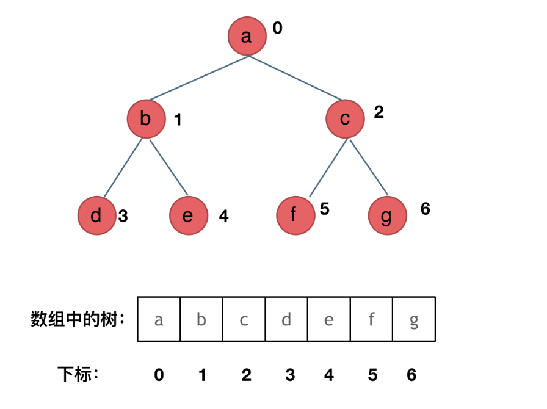
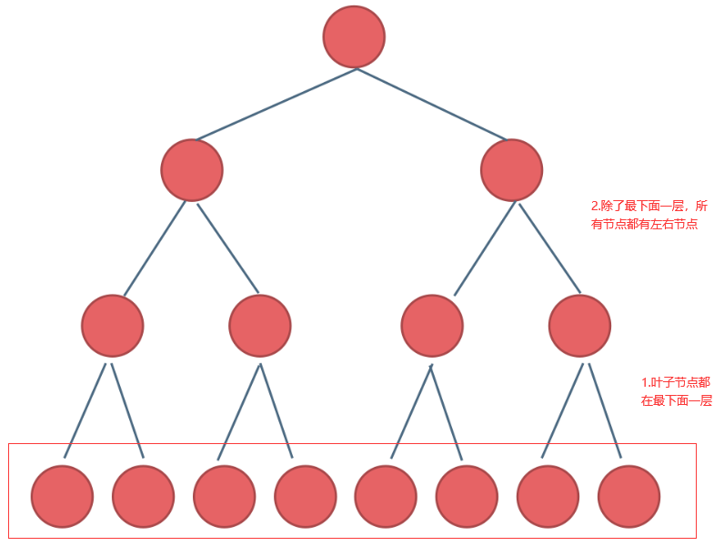

# 二叉树

## 基础

先来看看**定义**：

```java
// Java
public class TreeNode {
    int val; // 值
  	TreeNode left; // 左节点
  	TreeNode right;// 右节点
  	TreeNode() {}
  	TreeNode(int val) { this.val = val; }
}
```

```go
// Go
type TreeNode struct {
    Val int
    Left *TreeNode
    Right *TreeNode
}
```


二叉树在结构上其实很简单，就是有一个左节点和一个右节点，相比于链表多了一个左节点，如果左节点都为null，那就成了链表。


再来看看二叉树的**存储方式**

二叉树的存储结构有两种，一种链式存储，一种顺序存储，平时我们看到的可能都是链式存储结构，顺序存储也很简单，就是二叉树的层次遍历结果




再来看看二叉树的**遍历顺序**：

二叉树的遍历顺序有两种：

- 深度优先遍历（DFS）
  - 前序遍历
  - 中序遍历
  - 后序遍历
- 广度优先遍历（BFS）


深度优先遍历的三种顺序指的是中间节点的遍历顺序，比如中序遍历就是左中右，中在中间遍历，所以是中序遍历；此外这三种遍历都有两种实现方法，递归法和迭代法，递归的本质就是栈，所以迭代法其实就是用栈实现


广度优先遍历比较简单，它的实现只有一种方法，迭代法，是用队列来实现的


最后来看看几个特别的二叉树：

**满二叉树**：



**完全二叉树**：

完全二叉树是完全按照从上到下，从左到右的顺序来摆放的，所以不可能有上面某个节点为空，或者左边某个节点为空的情况


**二叉搜索树**：

左子树的所有节点都小于根节点，右子树的所有节点都大于根节点，中序遍历结果是递增的


**平衡二叉搜索树（AVL）**：

在二叉搜索树的基础上，左右子树的高度差不超过1


### 二叉树的遍历

[前序遍历](https://leetcode.cn/problems/binary-tree-preorder-traversal/)

[中序遍历](https://leetcode.cn/problems/binary-tree-inorder-traversal/)

[后序遍历](https://leetcode.cn/problems/binary-tree-postorder-traversal/)

#### 递归遍历

递归三要素：

1. 确定递归函数的参数和返回值
2. 确定终止条件
3. 确定单层递归的逻辑

```go
/**
 * Definition for a binary tree node.
 * type TreeNode struct {
 *     Val int
 *     Left *TreeNode
 *     Right *TreeNode
 * }
 */
// 前序遍历
func preorderTraversal(root *TreeNode) []int {
    res := []int{}
    var preorder func(root *TreeNode)
    preorder = func(root * TreeNode) {
        if root == nil {
            return
        }
        res = append(res, root.Val)
        preorder(root.Left)
        preorder(root.Right)
    }
    preorder(root)
    return res
}

// 中序遍历
func inorderTraversal(root *TreeNode) []int {
    res := []int{}
    var inorder func(root *TreeNode)
    inorder = func(root * TreeNode) {
        if root == nil {
            return
        }
        inorder(root.Left)
        res = append(res, root.Val)
        inorder(root.Right)
    }
    inorder(root)
    return res
}

// 后序遍历
func postorderTraversal(root *TreeNode) []int {
    res := []int{}
    var postorder func(root *TreeNode)
    postorder = func(root * TreeNode) {
        if root == nil {
            return
        }
        postorder(root.Left)
        postorder(root.Right)
        res = append(res, root.Val)
    }
    postorder(root)
    return res
}
```


#### 迭代遍历

迭代法就是用栈来模拟递归，因为前序遍历和后序遍历都可以通过先遍历中间节点来实现，因为栈是先进后出，所以需要反着来，前序遍历入栈的时候先放入右节点，再放入左节点，而中间节点直接加入到结果中；而后序遍历就是反过来，先放入左节点，再放入右节点，最后的结果是中右左，所以最后需要将结果反转；而中序遍历则不能和前2种一样，需要使用指针来遍历

```go
// 前序遍历
func preorderTraversal(root *TreeNode) []int {
    res := []int{}
    if root == nil {
        return res
    }
    stack := []*TreeNode{root}
    for len(stack) > 0 {
        node := stack[len(stack)-1]
        stack = stack[:len(stack)-1]
        res = append(res, node.Val)
        if node.Right != nil {
            stack = append(stack, node.Right)
        }
        if node.Left != nil {
            stack = append(stack, node.Left)
        }
    }
    return res
}

// 中序遍历
func inorderTraversal(root *TreeNode) []int {
    res := []int{}
    cur := root
    stack := []*TreeNode{}
    for cur != nil || len(stack) > 0 {
        if cur != nil {
            stack = append(stack, cur)
            cur = cur.Left
        } else {
            cur = stack[len(stack)-1]
            stack = stack[:len(stack)-1]
            res = append(res, cur.Val)
            cur = cur.Right
        }
    }
    return res
}

// 后序遍历
func postorderTraversal(root *TreeNode) []int {
    res := []int{}
    if root == nil {
        return res
    }
    stack := []*TreeNode{root}
    for len(stack) > 0 {
        node := stack[len(stack)-1]
        stack = stack[:len(stack)-1]
        res = append(res, node.Val)
        if node.Left != nil {
            stack = append(stack, node.Left)
        }
        if node.Right != nil {
            stack = append(stack, node.Right)
        }
    }
    reverse(res)
    return res
}
func reverse(a []int) {
    l, r := 0, len(a) - 1
    for l < r {
        a[l], a[r] = a[r], a[l]
        l, r = l+1, r-1
    }
}
```


此外迭代法还有统一的写法：

```go
/**
 type Element struct {
    // 元素保管的值
    Value interface{}
    // 内含隐藏或非导出字段
}

func (l *List) Back() *Element 
前序遍历：中左右
压栈顺序：右左中
 **/
func preorderTraversal(root *TreeNode) []int {
	if root == nil {
		return nil
	}
	var stack = list.New()//栈
    res:=[]int{}//结果集
    stack.PushBack(root)
    var node *TreeNode
    for stack.Len()>0{
        e := stack.Back()
        stack.Remove(e)//弹出元素
        if e.Value==nil{// 如果为空，则表明是需要处理中间节点
            e=stack.Back()//弹出元素（即中间节点）
            stack.Remove(e)//删除中间节点
            node=e.Value.(*TreeNode)
            res=append(res,node.Val)//将中间节点加入到结果集中
            continue//继续弹出栈中下一个节点
        }
        node = e.Value.(*TreeNode)
        //压栈顺序：右左中
        if node.Right!=nil{
            stack.PushBack(node.Right)
        }
        if node.Left!=nil{
            stack.PushBack(node.Left)
        }
        stack.PushBack(node)//中间节点压栈后再压入nil作为中间节点的标志符
        stack.PushBack(nil)
    }
    return res

}

//中序遍历：左中右
 //压栈顺序：右中左
func inorderTraversal(root *TreeNode) []int {
    if root==nil{
       return nil
    }
    stack:=list.New()//栈
    res:=[]int{}//结果集
    stack.PushBack(root)
    var node *TreeNode
    for stack.Len()>0{
        e := stack.Back()
        stack.Remove(e)
        if e.Value==nil{// 如果为空，则表明是需要处理中间节点
            e=stack.Back()//弹出元素（即中间节点）
            stack.Remove(e)//删除中间节点
            node=e.Value.(*TreeNode)
            res=append(res,node.Val)//将中间节点加入到结果集中
            continue//继续弹出栈中下一个节点
        }
        node = e.Value.(*TreeNode)
        //压栈顺序：右中左
        if node.Right!=nil{
            stack.PushBack(node.Right)
        }
        stack.PushBack(node)//中间节点压栈后再压入nil作为中间节点的标志符
        stack.PushBack(nil)
        if node.Left!=nil{
            stack.PushBack(node.Left)
        }
    }
    return res
}

//后续遍历：左右中
//压栈顺序：中右左
func postorderTraversal(root *TreeNode) []int {
	if root == nil {
		return nil
	}
	var stack = list.New()//栈
    res:=[]int{}//结果集
    stack.PushBack(root)
    var node *TreeNode
    for stack.Len()>0{
        e := stack.Back()
        stack.Remove(e)
        if e.Value==nil{// 如果为空，则表明是需要处理中间节点
            e=stack.Back()//弹出元素（即中间节点）
            stack.Remove(e)//删除中间节点
            node=e.Value.(*TreeNode)
            res=append(res,node.Val)//将中间节点加入到结果集中
            continue//继续弹出栈中下一个节点
        }
        node = e.Value.(*TreeNode)
        //压栈顺序：中右左
        stack.PushBack(node)//中间节点压栈后再压入nil作为中间节点的标志符
        stack.PushBack(nil)
        if node.Right!=nil{
            stack.PushBack(node.Right)
        }
        if node.Left!=nil{
            stack.PushBack(node.Left)
        }
    }
    return res
}
```


#### 层序遍历

##### [[102. 二叉树的层序遍历]](https://leetcode.cn/problems/binary-tree-level-order-traversal/)

```go
func levelOrder(root *TreeNode) [][]int {
    res := [][]int{}
    if root == nil {
        return res
    }
    queue := []*TreeNode{root}
    for len(queue) > 0 {
        size := len(queue)
        level := []int{}
        for i := 0; i < size; i++ {
            node := queue[0]
            queue = queue[1:]
            level = append(level, node.Val)
            if node.Left != nil {
                queue = append(queue, node.Left)
            }
            if node.Right != nil {
                queue = append(queue, node.Right)
            }
        }
        res = append(res, level)
    }
    return res
}
```


##### [107.二叉树的层次遍历II]()

```go
// 思路：将层次遍历结果反转即可
func levelOrderBottom(root *TreeNode) [][]int {
    res := [][]int{}
    if root == nil {
        return res
    }
    queue := []*TreeNode{root}
    for len(queue) > 0 {
        size := len(queue)
        level := []int{}
        for i := 0; i < size; i++ {
            node := queue[0]
            queue = queue[1:]
            level = append(level, node.Val)
            if node.Left != nil {
                queue = append(queue, node.Left)
            }
            if node.Right != nil {
                queue = append(queue, node.Right)
            }
        }
        res = append(res, level)
    }
    reverse(res)
    return res
}

func reverse(nums [][]int) {
    i, j := 0, len(nums)-1
    for i < j {
        nums[i], nums[j] = nums[j], nums[i]
        i++
        j--
    }
}
```


##### [199.二叉树的右视图]()

```go
// 思路：取右视图即取层次遍历结果每层的最后一个节点即可
func rightSideView(root *TreeNode) []int {
    res := []int{}
    if root == nil {
        return res
    }
    queue := []*TreeNode{root}
    for len(queue) > 0 {
        size := len(queue)
        for i := 0; i < size; i++ {
            node := queue[0]
            queue = queue[1:]
            if i == size-1 {
                res = append(res, node.Val)
            }
            if node.Left != nil {
                queue = append(queue, node.Left)
            }
            if node.Right != nil {
                queue = append(queue, node.Right)
            }
        }
    }
    return res
}
```


#####  [637. 二叉树的层平均值](https://leetcode.cn/problems/average-of-levels-in-binary-tree/)

```go
// BFS：每层取平均值即可
func averageOfLevels(root *TreeNode) []float64 {
    res := []float64{}
    if root == nil {
        return res
    }
    queue := []*TreeNode{root}
    for len(queue) > 0 {
        size := len(queue)
        sum := 0
        for i := 0; i < size; i++ {
            node := queue[0]
            queue = queue[1:]
            sum += node.Val
            if node.Left != nil {
                queue = append(queue, node.Left)
            }
            if node.Right != nil {
                queue = append(queue, node.Right)
            }
        }
        res = append(res, float64(sum)/float64(size))
    }
    return res
}
```


##### [429. N 叉树的层序遍历](https://leetcode.cn/problems/n-ary-tree-level-order-traversal/)

```go
// BFS
func levelOrder(root *Node) [][]int {
    res := [][]int{}
    if root == nil {
        return res
    }
    queue := []*TreeNode{root}
    for len(queue) > 0 {
        size := len(queue)
        level := []int{}
        for i := 0; i < size; i++ {
            node := queue[0]
            queue = queue[1:]
            level = append(level, node.Val)
            for _,child := range node.Children {
                if child != nil {
                    queue = append(queue, child)
                }
            }
        }
        res = append(res, level)
    }
    return res
}
```


##### [515. 在每个树行中找最大值](https://leetcode.cn/problems/find-largest-value-in-each-tree-row/)

```go
// BFS
func largestValues(root *TreeNode) []int {
    res := []int{}
    if root == nil {
        return res
    }
    queue := []*TreeNode{root}
    for len(queue) > 0 {
        size := len(queue)
        max := queue[0].Val
        for i := 0; i < size; i++ {
            node := queue[0]
            queue = queue[1:]
            if node.Val > max {
                max = node.Val
            }
            if node.Left != nil {
                queue = append(queue, node.Left)
            }
            if node.Right != nil {
                queue = append(queue, node.Right)
            }
        }
        res = append(res, max)
    }
    return res
}
```


##### [116. 填充每个节点的下一个右侧节点指针](https://leetcode.cn/problems/populating-next-right-pointers-in-each-node/)

```go
// BFS
func connect(root *Node) *Node {
    if root == nil {
        return root
    }
    queue := []*Node{root}
    for len(queue) > 0 {
        size := len(queue)
        var pre *Node = nil
        for i := 0; i < size; i++ {
            node := queue[0]
            queue = queue[1:]
            if pre != nil {
                pre.Next = node
            }
            pre = node
            if node.Left != nil {
                queue = append(queue, node.Left)
            }
            if node.Right != nil {
                queue = append(queue, node.Right)
            }
        }
    }
    return root
}
```


##### [117. 填充每个节点的下一个右侧节点指针 II](https://leetcode.cn/problems/populating-next-right-pointers-in-each-node-ii/)

```go
// 同上 
// TODO：其他解法
func connect(root *Node) *Node {
	if root == nil {
        return root
    }
    queue := []*Node{root}
    for len(queue) > 0 {
        size := len(queue)
        var pre *Node = nil
        for i := 0; i < size; i++ {
            node := queue[0]
            queue = queue[1:]
            if pre != nil {
                pre.Next = node
            }
            pre = node
            if node.Left != nil {
                queue = append(queue, node.Left)
            }
            if node.Right != nil {
                queue = append(queue, node.Right)
            }
        }
    }
    return root
}
```


##### [104. 二叉树的最大深度](https://leetcode.cn/problems/maximum-depth-of-binary-tree/)

```go
func maxDepth(root *TreeNode) int {
    if root == nil {
        return 0
    }
    depth := 0
    queue := []*TreeNode{root}
    for len(queue) > 0 {
        size := len(queue)
        for i := 0; i < size; i++ {
            node := queue[0]
            queue = queue[1:]
            if node.Left != nil {
                queue = append(queue, node.Left)
            }
            if node.Right != nil {
                queue = append(queue, node.Right)
            }
        }
        depth++
    }
    return depth
}
```


##### [111. 二叉树的最小深度](https://leetcode.cn/problems/minimum-depth-of-binary-tree/)

```go
func minDepth(root *TreeNode) int {
    if root == nil {
        return 0
    }
    depth := 0
    queue := []*TreeNode{root}
    for len(queue) > 0 {
        size := len(queue)
        depth++
        for i := 0; i < size; i++ {
            node := queue[0]
            queue = queue[1:]
            if node.Left == nil && node.Right == nil {
                return depth
            }
            if node.Left != nil {
                queue = append(queue, node.Left)
            }
            if node.Right != nil {
                queue = append(queue, node.Right)
            }
        }   
    }
    return depth
}
```


## 常见算法题

#### [226. 翻转二叉树](https://leetcode.cn/problems/invert-binary-tree/)

```go
// 递归，左右节点互换即可
func invertTree(root *TreeNode) *TreeNode {
    if root != nil {
        root.Left, root.Right = invertTree(root.Right), invertTree(root.Left)
    }
    return root
}

// 迭代法，使用BFS即可
func invertTree(root *TreeNode) *TreeNode {
    if root == nil {
        return root
    }
    queue := []*TreeNode{root}
    for len(queue) > 0 {
        size := len(queue)
        for i := 0; i < size; i++ {
            node := queue[0]
            queue = queue[1:]
            node.Left, node.Right = node.Right, node.Left
            if node.Left != nil {
                queue = append(queue, node.Left)
            }
            if node.Right != nil {
                queue = append(queue, node.Right)
            }
        }   
    }
    return root
}
```


#### [101. 对称二叉树](https://leetcode.cn/problems/symmetric-tree/)

```go
// 递归法
func isSymmetric(root *TreeNode) bool {
    return defs(root.Left, root.Right)
}
// 将左右节点作为参数分别传入
func defs(left *TreeNode, right *TreeNode) bool {
    if left == nil && right == nil {
        return true;
    };
    if left == nil || right == nil {
        return false;
    };
    if left.Val != right.Val {
        return false;
    }
    return defs(left.Left, right.Right) && defs(right.Left, left.Right);
}

// 迭代法：在加入队列时将相对应的一起加入，取出时也一起取出
func isSymmetric(root *TreeNode) bool {
    queue := []*TreeNode{root.Left, root.Right}
    for len(queue) > 0 {
        left := queue[0]
        right := queue[1]
        queue = queue[2:]
        if left == nil && right == nil {
            continue
        }
        if left == nil || right == nil || left.Val != right.Val {
            return false
        }
        queue = append(queue, left.Left, right.Right, left.Right, right.Left)
    }
    return true
}

```


#### [559. N 叉树的最大深度](https://leetcode.cn/problems/maximum-depth-of-n-ary-tree/)

```go
// BFS
func maxDepth(root *Node) int {
    if root == nil {
        return 0
    }
    depth := 0
    queue := []*Node{root}
    for len(queue) > 0 {
        size := len(queue)
        for i := 0; i < size; i++ {
            node := queue[0]
            queue = queue[1:]
            for _, child := range node.Children {
                queue = append(queue, child)
            }
        }
        depth++
    }
    return depth
}
```


#### [222. 完全二叉树的节点个数](https://leetcode.cn/problems/count-complete-tree-nodes/)

```go
func countNodes(root *TreeNode) int {
    if root == nil {
        return 0
    }
    count := 0
    queue := []*TreeNode{root}
    for len(queue) > 0 {
        size := len(queue)
        for i := 0; i < size; i++ {
            node := queue[0]
            queue = queue[1:]
            count++
            if node.Left != nil {
                queue = append(queue, node.Left)
            }
            if node.Right != nil {
                queue = append(queue, node.Right)
            }
        }
    }
    return count
}
```


[110. 平衡二叉树](https://leetcode.cn/problems/balanced-binary-tree/)

```go
// 递归法
func isBalanced(root *TreeNode) bool {
    return getHeight(root) != -1
}

func getHeight(root *TreeNode) int {
    if root == nil {
        return 0
    }
    left := getHeight(root.Left)
    right := getHeight(root.Right)
    if left == -1 || right == -1 || math.Abs(float64(left-right)) > 1 {
        return -1
    }
    return int(math.Max(float64(left), float64(right))) + 1
    
}
```


#### [257. 二叉树的所有路径](https://leetcode.cn/problems/binary-tree-paths/)

```go
// 递归法
func binaryTreePaths(root *TreeNode) []string {
    res := []string{}
    var travel func(root *TreeNode, s string)
    travel = func(root *TreeNode, s string) {
        if root.Left == nil && root.Right == nil {
            res = append(res, s + strconv.Itoa(root.Val))
            return 
        }
        s += strconv.Itoa(root.Val) + "->"
        if root.Left != nil {
            travel(root.Left, s)
        }
        if root.Right != nil {
            travel(root.Right, s)
        }
    }
    travel(root, "")
    return res
}
```


#### [100. 相同的树](https://leetcode.cn/problems/same-tree/)

```go
// 递归
func isSameTree(p *TreeNode, q *TreeNode) bool {
    if p == nil && q == nil {
        return true
    }
    if p == nil || q == nil || p.Val != q.Val {
        return false
    }
    return isSameTree(p.Left, q.Left) && isSameTree(p.Right, q.Right)
}
```


#### [404. 左叶子之和](https://leetcode.cn/problems/sum-of-left-leaves/)

```go
func sumOfLeftLeaves(root *TreeNode) int {
    if root == nil {
        return 0
    }
    sum := 0
    if root.Left != nil && root.Left.Left == nil && root.Left.Right == nil {
        sum += root.Left.Val
    }
    sum += sumOfLeftLeaves(root.Left) + sumOfLeftLeaves(root.Right)
    return sum
}
```


#### [513. 找树左下角的值](https://leetcode.cn/problems/find-bottom-left-tree-value/)

```go
// 递归
func findBottomLeftValue(root *TreeNode) int {
    maxLen := 1
    maxValue := root.Val
    var travel func(root *TreeNode, length int)
    travel = func(root *TreeNode, length int) {
        if root.Left == nil && root.Right == nil {
            if (length > maxLen) {
                maxLen = length
                maxValue = root.Val
                return
            }
        }
        if root.Left != nil {
            travel(root.Left, length+1)
        }
        if root.Right != nil {
            travel(root.Right, length+1)
        }
    }
    travel(root, 1)
    return maxValue
}
```


#### [112. 路径总和](https://leetcode.cn/problems/path-sum/)

```go
func hasPathSum(root *TreeNode, targetSum int) bool {
    if root == nil {
        return false
    }
    if targetSum == root.Val && root.Left == nil && root.Right == nil {
        return true
    }
    return hasPathSum(root.Left, targetSum - root.Val) || hasPathSum(root.Right, targetSum - root.Val)
}
```


#### [113. 路径总和 II](https://leetcode.cn/problems/path-sum-ii/)

```go
func pathSum(root *TreeNode, targetSum int) [][]int {
    res := [][]int{}
    var travel func(root *TreeNode, targetSum int, path []int)
    travel = func(root *TreeNode, targetSum int, path []int) {
        if root == nil {
            return 
        }
        path = append(path, root.Val)
        if root.Left == nil && root.Right == nil && root.Val == targetSum {
            p := make([]int, len(path))
            copy(p, path) // 注意此处，需要复制一个slice
            res = append(res, p)
            return 
        }
        if root.Left != nil {
            travel(root.Left, targetSum - root.Val, path)
        }
        if root.Right != nil {
            travel(root.Right, targetSum - root.Val, path)
        }
    }
    travel(root, targetSum, []int{})
    return res
}
```


#### [106. 从中序与后序遍历序列构造二叉树](https://leetcode.cn/problems/construct-binary-tree-from-inorder-and-postorder-traversal/)

```go
func buildTree(inorder []int, postorder []int) *TreeNode {
    n := len(inorder)
    if n <= 0 {
        return nil
    }
    mid := postorder[n-1]
    index := 0
    for i := 0; i < n; i++ { // 找到root节点在inorder中的下标
        if inorder[i] == mid {
            index = i
            break
        }
    }
    root := &TreeNode {
        Val: mid,
        Left: buildTree(inorder[:index], postorder[:index]),
        Right: buildTree(inorder[index+1:], postorder[index:n-1]),
    }
    return root
}
```


#### [105. 从前序与中序遍历序列构造二叉树](https://leetcode.cn/problems/construct-binary-tree-from-preorder-and-inorder-traversal/)

```go
func buildTree(preorder []int, inorder []int) *TreeNode {
    n := len(inorder)
    if n <= 0 {
        return nil
    }
    mid := preorder[0]
    index := 0
    for i := 0; i < n; i++ { // 找到root节点在inorder中的下标
        if inorder[i] == mid {
            index = i
            break
        }
    }
    root := &TreeNode {
        Val: mid,
        Left: buildTree(preorder[1:index+1], inorder[:index]),
        Right: buildTree(preorder[index+1:], inorder[index+1:]),
    }
    return root
}
```


#### [654. 最大二叉树](https://leetcode.cn/problems/maximum-binary-tree/)

```go
func constructMaximumBinaryTree(nums []int) *TreeNode {
    if len(nums) <= 0 {
        return nil
    }
    maxNum := nums[0]
    maxIndex := 0
    for i, v := range nums {
        if v > maxNum {
            maxNum = v
            maxIndex = i
        }
    }
    return &TreeNode {
        Val: maxNum,
        Left: constructMaximumBinaryTree(nums[:maxIndex]),
        Right: constructMaximumBinaryTree(nums[maxIndex+1:]),
    }
}
```


#### [617. 合并二叉树](https://leetcode.cn/problems/merge-two-binary-trees/)

```go
func mergeTrees(root1 *TreeNode, root2 *TreeNode) *TreeNode {
    if root1 == nil && root2 == nil {
        return nil
    }
    root := &TreeNode {}
    if root1 == nil {
        root = root2
    } else if root2 == nil {
        root = root1
    } else {
        root = &TreeNode {
            Val: root1.Val+root2.Val,
            Left: mergeTrees(root1.Left, root2.Left),
            Right: mergeTrees(root1.Right, root2.Right),
        }
    }
    return root
}
```


#### [700. 二叉搜索树中的搜索](https://leetcode.cn/problems/search-in-a-binary-search-tree/)

```go
func searchBST(root *TreeNode, val int) *TreeNode {
    if root == nil {
        return nil
    }
    if root.Val == val {
        return root
    }
    node := searchBST(root.Left, val)
    if  node != nil {
        return node
    }
    node = searchBST(root.Right, val)
    return node
}
```


#### [98. 验证二叉搜索树](https://leetcode.cn/problems/validate-binary-search-tree/)

```go
func isValidBST(root *TreeNode) bool {
    var verify func(root *TreeNode, min, max int64) bool
    verify = func(root *TreeNode, min, max int64) bool {
        if root == nil {
        return true
    }

    if min >= int64(root.Val) || max <= int64(root.Val) {
        return false
    }
    // 分别对左子树和右子树递归判断，如果左子树和右子树都符合则返回true
    return verify(root.Right,int64(root.Val),max) && verify(root.Left,min,int64(root.Val))
    }
    return verify(root, math.MinInt64, math.MaxInt64)
}
```


#### [530. 二叉搜索树的最小绝对差](https://leetcode.cn/problems/minimum-absolute-difference-in-bst/)

```go
// 递归
func getMinimumDifference(root *TreeNode) int {
    var dfs func(node *TreeNode)
    min := 100000
    pre := -1
    dfs = func(node *TreeNode) {
        if node == nil {
            return 
        }
        dfs(node.Left)
        if pre != -1 && node.Val - pre < min {
            min = node.Val - pre
        }
        pre = node.Val
        dfs(node.Right)
    }
    dfs(root)
    return min
}
```


#### [501. 二叉搜索树中的众数](https://leetcode.cn/problems/find-mode-in-binary-search-tree/)

```go
// 计数
func findMode(root *TreeNode) []int {
    var dfs func(node *TreeNode)
    res := []int{}
    maxCount := 0
    count := 0
    cur := 0
    dfs = func(node *TreeNode) {
        if node == nil {
            return 
        }
        dfs(node.Left)
        if node.Val == cur {
            count++
        } else {
            count = 1
        }
        cur = node.Val
        if count > maxCount {
            maxCount = count
            res = []int{}
        }
        if count == maxCount {
            res = append(res, cur)
        }
        dfs(node.Right)
    }
    dfs(root)
    return res
}
```


#### [236. 二叉树的最近公共祖先](https://leetcode.cn/problems/lowest-common-ancestor-of-a-binary-tree/)

```go
func lowestCommonAncestor(root, p, q *TreeNode) *TreeNode {
    if root == nil {
        return nil
    }
    if root == p || root == q {
        return root
    }
    left := lowestCommonAncestor(root.Left, p, q)
    right := lowestCommonAncestor(root.Right, p, q)
    if left != nil && right != nil {
        return root
    }
    if left != nil {
        return left
    }
    if right != nil {
        return right
    }
    return nil
}
```


[235. 二叉搜索树的最近公共祖先](https://leetcode.cn/problems/lowest-common-ancestor-of-a-binary-search-tree/)

```go
func lowestCommonAncestor(root, p, q *TreeNode) *TreeNode {
	if root == nil {
        return nil
    }
    if root == q || root == p || (root.Val >= p.Val && root.Val <= q.Val) || (root.Val <= p.Val && root.Val >= q.Val) {
        return root
    }
    if root.Val > p.Val && root.Val > q.Val {
        return lowestCommonAncestor(root.Left, p, q)
    }
    if root.Val < p.Val && root.Val < q.Val {
        return lowestCommonAncestor(root.Right, p, q)
    }
    return nil
}
```


#### [701. 二叉搜索树中的插入操作](https://leetcode.cn/problems/insert-into-a-binary-search-tree/)

```go
// 利用二叉搜索树的性质找到要插入的位置，注意root可能为nil
func insertIntoBST(root *TreeNode, val int) *TreeNode {
    if root == nil {
        return &TreeNode{
            Val: val,
        }
    }
    cur := root
    for cur != nil {
        if cur.Val > val {
            if cur.Left == nil {
                cur.Left = &TreeNode{
                    Val: val,
                }
                return root
            }
            cur = cur.Left
        } else {
            if cur.Right == nil {
                cur.Right = &TreeNode{
                    Val: val,
                }
                return root
            }
            cur = cur.Right
        }
    }
    return root
}
```


#### [450. 删除二叉搜索树中的节点](https://leetcode.cn/problems/delete-node-in-a-bst/)

```go
func deleteNode(root *TreeNode, key int) *TreeNode {
    if root == nil {
        return nil
    }
    if root.Val == key {
        if root.Left == nil && root.Right == nil {
            return nil
        } else if root.Right == nil {
            return root.Left
        } else if root.Left == nil {
            return root.Right
        } else {
            cur := root.Right
            for cur.Left != nil {
                cur = cur.Left
            }
            cur.Left = root.Left
            return root.Right
        }
    } else if root.Val > key {
        root.Left = deleteNode(root.Left, key)
    } else {
        root.Right = deleteNode(root.Right, key)
    }
    return root
}
```


#### [669. 修剪二叉搜索树](https://leetcode.cn/problems/trim-a-binary-search-tree/)

```go
func trimBST(root *TreeNode, low int, high int) *TreeNode {
    if root == nil {
        return nil
    } else if root.Val < low {
        return trimBST(root.Right, low, high)
    } else if root.Val > high {
        return trimBST(root.Left, low, high)
    } else {
        root.Left = trimBST(root.Left, low, high)
        root.Right = trimBST(root.Right, low, high)
    }
    return root
}
```


#### [108. 将有序数组转换为二叉搜索树](https://leetcode.cn/problems/convert-sorted-array-to-binary-search-tree/)

```go
func sortedArrayToBST(nums []int) *TreeNode {
    n := len(nums)
    if n == 0 {
        return nil
    }
    mid := n/2
    root := &TreeNode {
        Val: nums[mid],
        Left: sortedArrayToBST(nums[:mid]),
        Right: sortedArrayToBST(nums[mid+1:]),
    }
    return root
}
```


#### [538. 把二叉搜索树转换为累加树](https://leetcode.cn/problems/convert-bst-to-greater-tree/)

```go
func convertBST(root *TreeNode) *TreeNode {
    sum := 0
    var dfs func(node *TreeNode)
    dfs = func(node *TreeNode)  {
        if node == nil {
            return 
        }
        dfs(node.Right)
        node.Val = sum + node.Val
        sum = node.Val
        dfs(node.Left)
    }
    dfs(root)
    return root
}
```

