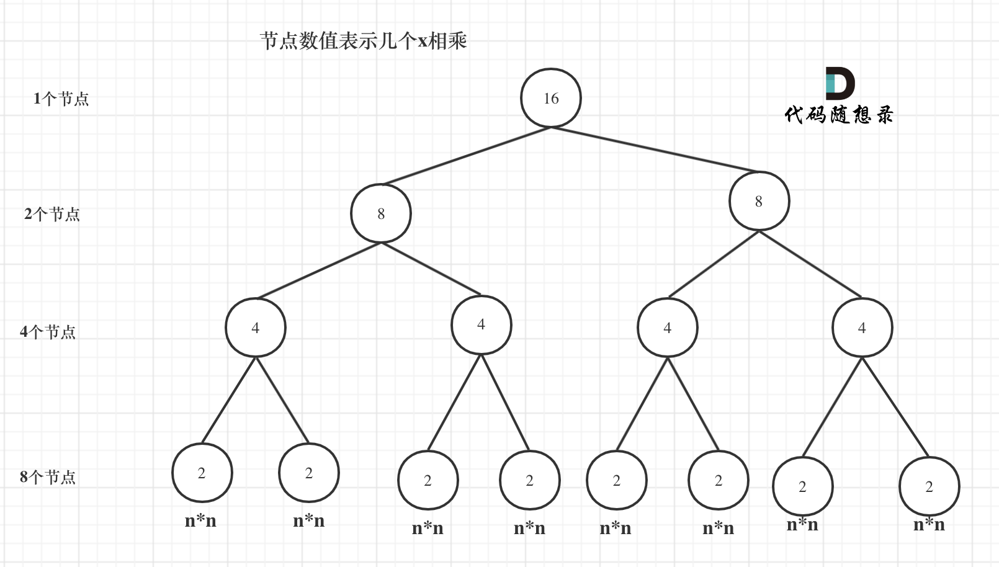

# 算法性能分析


## 时间复杂度

### 概念

- 时间复杂度：是一个与算法规模n相关的函数，用来描述算法的运行时间与规模之间的关系
- 大O：通常来讲，大O用来表示一般情况的时间复杂度，在《算法导论》中为上界


### 常见时间复杂度

1. O(n)
2. O(logn)
3. O(n^2)
4. O(nlogn)


计算时间复杂度时，我们往往是忽略常数的，包括n前的常数，以及logn的底数


### 递归的时间复杂度

递归算法的时间复杂度本质上是要看: **递归的次数 \* 每次递归的时间复杂度**

示例1：

```
int function2(int x, int n) {
    if (n == 0) {
        return 1; // return 1 同样是因为0次方是等于1的
    }
    return function2(x, n - 1) * x;
}
```

在这个例子中，每次递归都是-1，很容易看出来复杂度为O(n)


示例2：

```
int function3(int x, int n) {
    if (n == 0) {
        return 1;
    }
    if (n % 2 == 1) {
        return function3(x, n / 2) * function3(x, n / 2)*x;
    }
    return function3(x, n / 2) * function3(x, n / 2);
}
```



在这个例子中，节点数为2^3+2^2+2^1+2^0=15，根据推导可以得出=n-1，所以复杂度为O(n)


示例3：

```
int function4(int x, int n) {
    if (n == 0) {
        return 1;
    }
    int t = function4(x, n / 2);// 这里相对于function3，是把这个递归操作抽取出来
    if (n % 2 == 1) {
        return t * t * x;
    }
    return t * t;
}
```

在该例子中，每次调用都是n/2，所以复杂度为O(logn)


#### 方法

分析递归算法的时间复杂度的关键点就在于每次递归时 参数的变化

- 对于一分为一的递归，我们可以根据参数变化转换为循环
  - 如每次调用为f(n/2)，可以看成for(int i = x; i < l; i*=2)
  - 如每次调用为f(n-x)，可以看成for(int i = x; i < l; i += x)
- 对于一分为多的递归，我们可以将递归想象成一个多叉树进行分析


## 空间复杂度

空间复杂度和时间复杂度大同小异

在一些简单的算法中，看程序中定义了多少数组、map这些即可

在递归算法中，**递归算法的空间复杂度 = 每次递归的空间复杂度 \* 递归深度**


## 总结

1. 递归算法
   1. 时间复杂度：每次递归的时间复杂度 * 递归的次数
   2. 空间复杂度：每次递归的空间复杂度 \* 递归深度
