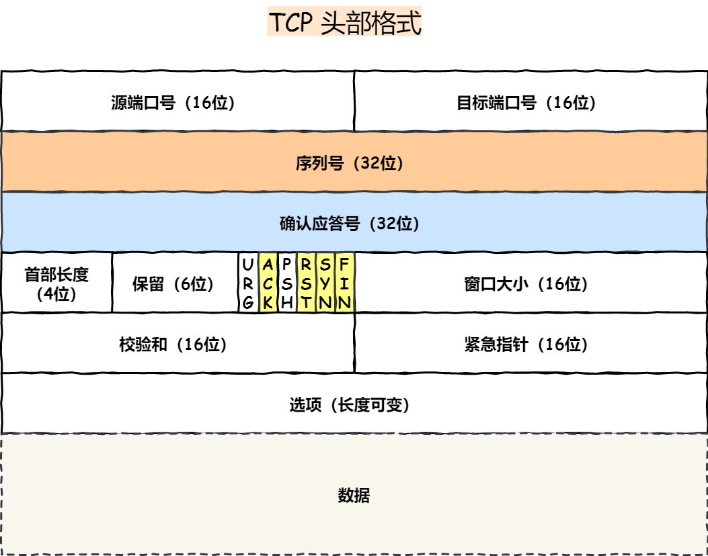

## 计算机网络分层

目前主要使用的网络模型为五层网络模型

#### 五层网络模型

- **应用层** ：为特定应用程序提供数据传输服务，例如 **HTTP**、**DNS** 等协议。数据单位为报文。
- **传输层** ：为进程提供通用数据传输服务。运输层包括两种协议：**TCP**， **UDP**。
- **网络层** ：为主机提供通信服务，**路由选择**。网络层有四个协议：**ARP**协议，**IP**协议，**ICMP**协议，**IGMP**协议
- **数据链路层** ：为同一链路的主机提供数据传输服务。将分组封装成帧。协议包括：**Ethernet**，**PPP**，[**CSMA/CD**](https://github.com/CyC2018/CS-Notes/blob/master/notes/计算机网络 - 链路层.md#csmacd-协议)
- **物理层** ：考虑的是怎样在传输媒体上传输数据比特流，而不是指具体的传输媒体。物理层的作用是尽可能屏蔽传输媒体和通信手段的差异，使数据链路层感觉不到这些差异。

#### 七层网络模型

#### 四层网络模型

1. 应用层
2. 传输层
3. 网络层
4. 网络接口层

## 应用层协议

### HTTP（超文本传输协议）

##### 首部字段

- **Host**：请求的服务器域名
- ***Content-Length***：响应数据长度
- ***Connection*** ：Keep-Alive为长连接
- **Content-Type**：响应体数据格式
- **Content-Encoding**：响应体数据压缩方式

##### 特点

优点：

1. 简单
2. 灵活易于扩展
3. 应用广泛，跨平台

缺点：

1. 无状态双刃剑
2. 明文传输双刃剑
3. 不安全（明文可能被**窃听**，不验证身份可能被**伪装**，无法证明报文完整性可能被**篡改**）

##### 状态码

- 1xx:提示信息
- 2xx：成功
  - **200**：OK，表示一切正常
  - 204：No content，与200的区别在于响应头没有body数据
  - 206：Partial Content，表示body为资源的一部分（应用于HTTP分块下载或断点续传）
- 3xx：重定向，301和302含字段`Location`表示跳转URL
  - **301**：永久重定向，请求资源已不存在
  - **302**：临时重定向，请求资源还存在
  - 304：缓存重定向，资源未修改，重定向到已存在的缓存文件
- 4xx：客户端错误
  - 400：请求报文错误，笼统的错误
  - **403**：服务器禁止访问资源
  - **404**：请求找不到资源
- 5xx：服务端错误
  - 500：笼统的错误，并不知道发生了什么错误
  - 501：客户端请求功能还不支持
  - 502：服务器作为网关或代理，服务器自身正常，访问后端服务器发生了错误
  - **503**：服务器繁忙

##### Get与Post的区别

1. Get用于请求资源，Post用于对资源做修改处理
2. Get是幂等和安全的，Post不是幂等和安全的（幂等指多次执行结果相同）
3. Get请求参数位于URL中，只支持ASCLL，长度有限制，Post请求数据在body中，无限制

##### HTTP1.1

1. 提出了**长连接**的通信方式，减少了TCP重复连接断开所带来的开销，减轻了服务器端的负载
2. **管道网络传输**：不需要等待前一个请求响应再发送，减少了整体的响应时间
3. **队头阻塞**：服务器端仍然是按照顺序响应，如果发生阻塞，会导致所有请求阻塞

##### HTTP2

1. **头部压缩**：使用HPACK算法进行压缩
2. **静态表编码**
3. **动态表编码**
4. **二进制帧**
5. **并发传输**：多条stream复用一条TCP连接
6. **服务器主动推送资源**

##### HTTP3

1. 基于UDP协议实现了**QUIC**协议，有以下优点
   - 无队头阻塞
   - 更快地连接建立
   - 连接迁移

##### HTTPS

###### 与HTTP的区别

- 在 TCP 和 HTTP 网络层之间加入了 **SSL/TLS** 安全协议，更加安全
- 在TCP三次握手基础上还需进行SSL/TLS 的握手
- HTTP 的端口号是 80，HTTPS 的端口号是 443
- HTTPS需向CA申请数字证书

###### 如何解决HTTP安全问题

- 信息加密（混合加密）实现机密性，解决窃听问题
- 效验机制（摘要算法）实现完整性，解决篡改问题
- 数字证书解决冒充问题

###### HTTPS通信过程

- 首先是服务器将自己的公钥注册到CA，CA用自己的私钥对服务器的公钥签名并颁发数字证书
- 服务器将数字证书发送给浏览器（事先置入了CA的公钥），浏览器对数字证书进行解密得到服务器的公钥
- 浏览器用服务器的公钥对报文进行加密发送
- 服务器用自己的私钥对报文进行解密

###### SSL/TLS握手

1. 客户端发送clientHello请求，包含版本，随机数（用于生产会话密钥），密码套件列表等信息
2. 服务端响应serverHello，包含确认的版本和密码套件列表，随机数（用户生产会话密钥），数字证书
3. 客户端回应一个加密的随机数，加密通信算法改变通知和客户端握手结束通知
4. 服务端通过加密算法得出会话密钥，最后回应加密通信算法改变通知和服务端握手结束通知

## 传输层协议

### TCP

##### 头部格式

